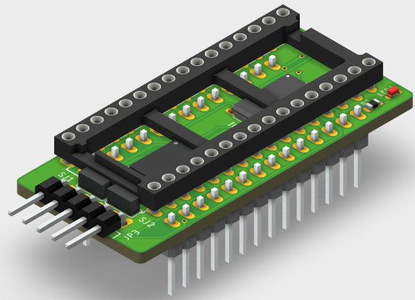
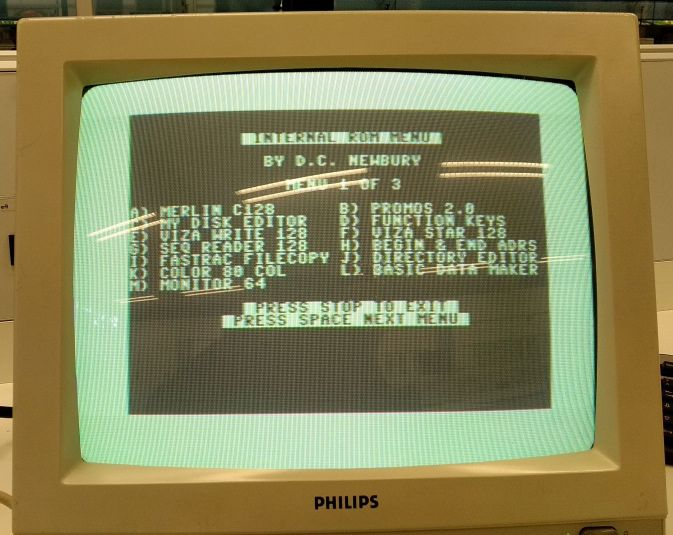
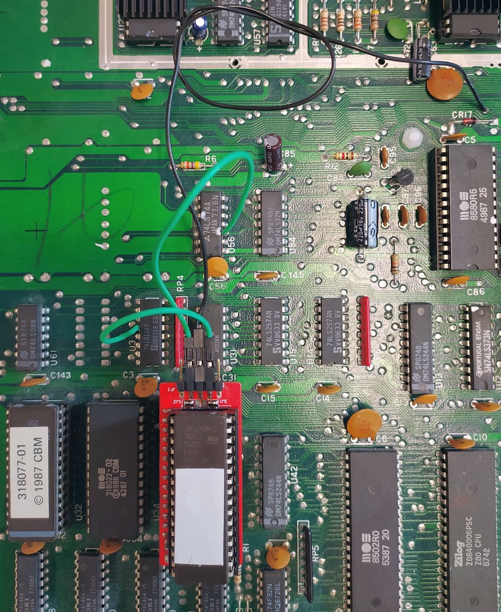

# C128_U36_adapter
A new design of the megabit adapter for U36 in the C128
  
  

# The story began
I tried to recreate the original Megabit adapter for the U36 socket in the C128.
The information to this project I found on cmb8bit.com. You can find the PDFs and the ROM binfile in the <strong>cmb8bit.com</strong> directory.

<ul>
    <li> <a href="./cbm8bit.com/Megabit_internal_rom_manual.pdf"> Megabit internal ROM manual</a> </li>
    <li> <a href="./cbm8bit.com/MegaBit-faq-howtoo.pdf"> Megabit FAQ HowTo</a> </li>
    <li> <a href="./cbm8bit.com/megabit-help.BIN"> megabit-help.bin</a> </li>
</ul>

# The issue began
I designed a PCB with the information of the PDFs and tested the soldered PCB.  
Unfurtunately it does not work :(  
Thankfully a guy (Kinzi) from the great Forum64 helped me out by troubleshooting.  
I scoped the signals and figured out, that the transistor I used was to slow to trigger the D-FF.  
After that I tried logic gates - but this does not work either.
I figured out that there is a GLITCH on Pin12 of U3  
  
The GLITCH triggered always the D-FF and so it does not work :( what a bummer ;(

# The solution
Kinzi mentioned that the /CS sigal from pin12 of U3 has to be synchronized with the 1MHz clock of the C128.  
So I poked around with this variation and that was the goal.  
The solution is to use two 74HCT173 D-FF and one 74HCT14 INV - so the /CS signal from pin 12 of U3 gets synchroninzed with the system clock
and addresses the ROM. BINGO  

# In the C128D-CR
  

# In the C128
  

# Fabrication files
You can find a panelized GERBER file version and a single file version.  
The panelized version should work for the most factories.
I ordered by JLCPCB.

Greetz 

JDet
                                    
                                   

